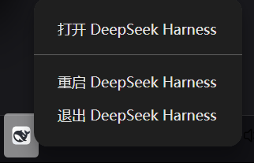

<h1 align="center">dsh-tray-restart</h1>

  <em>Copy one prompt and add “Restart DeepSeek Harness” to the official tray menu—without a second icon.</em>

  
  
  
  
  

  <a href="README.md">中文</a> · <b>English</b>

---

  

## What it does

This repository ships no Cordis plugin and starts no helper process. Its deliverable is a copy-ready Harness prompt that adds **Restart DeepSeek Harness** to the existing Electron tray menu.

- One official tray icon
- Native `app.relaunch()` flow
- No runtime dependency or background process
- Hash-verified backup and rollback record
- Structure-aware, idempotent patching that stops on ambiguity

> [!IMPORTANT]
> This is a community workflow for the Windows desktop build, not an official DSH extension API. A DSH update may replace `resources/app.asar`; rerun the prompt after an update instead of restoring an older build over the new one.

## Quick start

The authoritative, copy-ready prompt is embedded in the [Chinese README](README.md#可直接复制的完整提示词). Open it, copy the complete block, and paste it into a new DeepSeek Harness desktop session with access to the DSH installation directory.

The prompt instructs Harness to:

1. identify the active desktop installation and version;
2. locate unique official `DesktopTray` menu and constructor anchors, inspect integrity/runtime policy read-only, and evaluate the complete Chinese **and** English labels;
3. return through a strict zero-file-write path—with no temporary artifacts—when the native feature is already correct;
4. only when a change is needed, prove a no-op ASAR round trip and create a collision-safe SHA-256-verified backup and manifest;
5. make the smallest native main-process change, limited to the official tray-menu region and the same tray instance's restart-options region (only whichever region is actually missing or wrong);
6. validate both full labels, JavaScript syntax, archive semantics, integrity metadata, and idempotency;
7. stage and safely replace `app.asar` only after every applicable gate passes;
8. report the evidence and wait for you to restart DSH manually.

## Expected result

| Check | Expected |
| --- | --- |
| Tray icons | One—the official DSH icon |
| Context menu | Existing items plus Restart DeepSeek Harness |
| Restart path | Electron `app.relaunch()` followed by DSH's quit flow |
| Added processes | None |
| Added profile plugins | None |
| Patch-specific network or credentials | No extra downloads/requests and no credential reads; normal Harness model transport is unchanged |
| After a DSH update | The prompt may need to be rerun |

Restarting interrupts in-flight work. Test only after the current agent turn has finished.

## Why prompt-only

The official tray belongs to the Electron main process. Cordis plugins run in a separate plain-Node host and cannot extend Electron's `Tray` or `Menu` API directly. A plugin implementation therefore needs its own helper tray and creates the exact duplicate-icon problem this project avoids.

The native approach has zero runtime overhead, with one trade-off: application updates can overwrite the built artifact. See [Design](docs/DESIGN.md).

## Compatibility

- Windows 10/11 desktop app
- Structural observation baseline: the official tray anchors, localization resources, and ASAR integrity metadata were inspected on DeepSeek Harness `0.2.0-rc.2`; this is not a claim that every machine has a safe ASAR writer
- Every version, including `0.2.0-rc.2`, must pass unique-anchor, read-only per-entry integrity, and Electron runtime-policy gates; a modification branch must additionally pass the writer/no-op-round-trip gate. Safe refusal is expected when an applicable capability is missing
- Not applicable to `dsh web`, which has no Electron system tray

## Documentation

- [Design and invariants](docs/DESIGN.md)
- [Verification checklist](docs/VERIFICATION.md)
- [Hash-gated rollback](docs/ROLLBACK.md)
- [Security policy](SECURITY.md)
- [Contributing](CONTRIBUTING.md)

The repository intentionally has no `package.json`, installer, or executable code. **The prompt in `README.md` is the product.**

## License

MIT © 2026 CAOGGL
